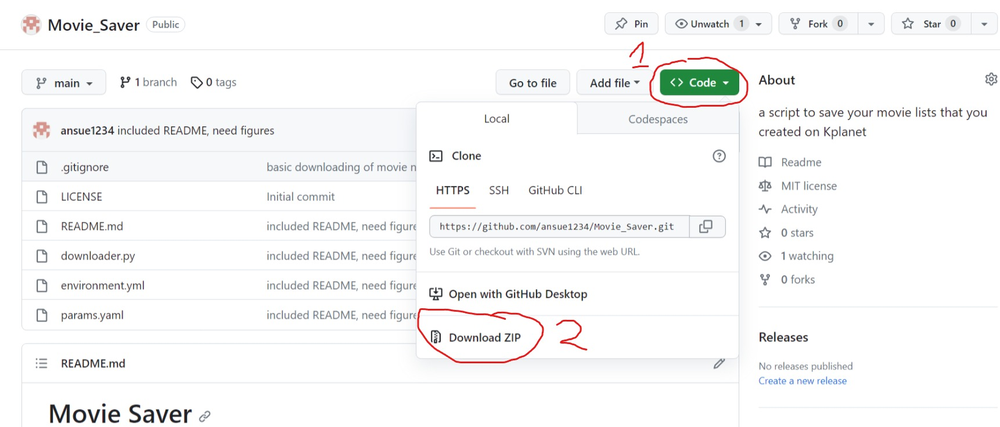
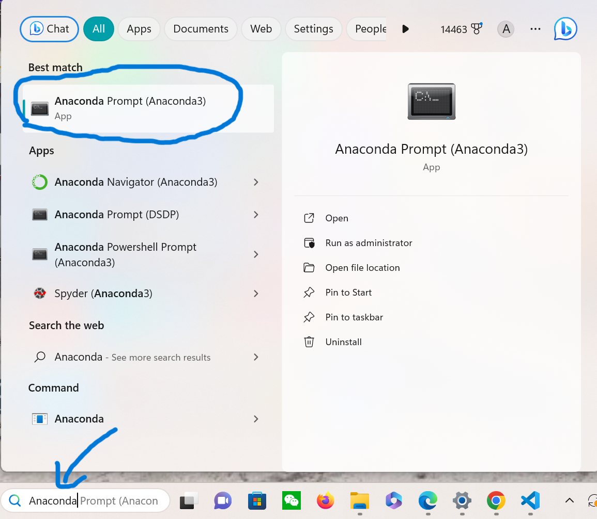
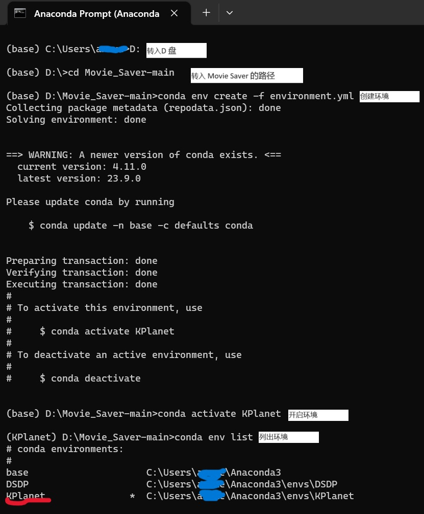

# Movie Saver

## 注意事项
**请得到K星球App客服官方许可再安装并运行此脚本下载影单资料! 若未得到许可，请勿安装并运行此脚本!!!**

## 简介
只需输入影单链接，此脚本可帮助K星球用户下载该影单的资料

## 安装指南 

**小贴士**
- 若是在外网环境中安装，体验更为顺畅
- 国内环境安装，由于从未测试过，并不保证可以安装成功

### 所需软件
1. 下载并安装Google Chrome
   - *国外*
     - 此处下载->[https://www.google.com/chrome/](https://www.google.com/chrome/)
   - *国内*
     - 此处下载->[https://www.google.cn/chrome/](https://www.google.cn/chrome/)
       - 若是不行，请参考->[https://zhuanlan.zhihu.com/p/57152816](https://zhuanlan.zhihu.com/p/57152816)
2. 下载Anaconda
   - *国外*
     - 此处下载->[https://www.anaconda.com/download/](https://www.anaconda.com/download/)
       - 可参考->[https://docs.anaconda.com/free/anaconda/install/index.html](https://docs.anaconda.com/free/anaconda/install/index.html)
   - *国内*
     - 请参考->[https://juejin.cn/post/7193347318827974714](https://juejin.cn/post/7193347318827974714)     
3. 下载Movie Saver
   **方法一**
   - 点击右上角绿色按钮 （图标是这样的 `<> code` )
   - 选择 `Download ZIP.`
   - 解压并保存至你喜欢的地方，建议存在有足够空间的文件夹里
     - 记一下保存的路径，例如：`C:\xxx\xxx\...\movie_saver-main`

   **方法二**
   - *推荐此方法，但可能会报错*
   - 下载git
     - [如何下载git](https://blog.csdn.net/weixin_39450145/article/details/125530804)
     - 打开 Command Prompt
        - `Win + S` 搜索 `Command Prompt`
     -  在 Command Prompt 中 `cd ` 到 你想下载 Movie Saver 的地点 (例如 `cd C:\Users\xxx\Documents`, 建议存在有足够空间的文件夹里)
        - 输入 `git clone https://github.com/ansue1234/Movie_Saver.git` 
        - `cd Movie_Saver`
        - `pwd` 并记下此路径，这将是 Movie Saver 的路径


### 安装步骤
1. 打开 Anaconda Prompt
   - `Win + S` 搜索`Anaconda Prompt`

1. 在Anaconda Prompt 中 `cd ` 到 Movie Saver 的路径
   - 例如: `D:\Movie_Saver-main` 或 `D:\Movie_Saver-main\Movie_Saver-main`
   - [如何查询文件夹的路径](https://zhidao.baidu.com/question/1905489514073876060.html)
     - 文件夹名称为：`Movie_Saver-main`
     - `cd <Movie_Saver-main的路径>`
2. 在Anaconda Prompt 中输入以下指令(在每一条指令运行完成后再输入下一条)
   - `conda env create -f environment.yml`
   - `conda activate KPlanet`
   - `conda env list`
     - 检查一下输出里有没有 `KPlanet`
  
以下是Anaconda Prompt 的操作界面以及我们输入的指令



## 使用指南
1. 打开Anaconda Prompt
2. 在Anaconda Prompt 中 `cd ` 到 Movie Saver 的路径
3. 在Anaconda Prompt 中输入以下指令(在每一条指令运行完成后再输入下一条)
   - `conda activate KPlanet`
4. 输入参数
   - [如何打开`YAML`文档](https://juejin.cn/s/yaml%E6%96%87%E4%BB%B6%E7%94%A8%E4%BB%80%E4%B9%88%E6%89%93%E5%BC%80)
   - 在`params.yaml`文档中， 可以直接在内修改参数
     - `url:` 后是你影单的链接
     - `download_cover:` 若是想下载电影海报，改为 `True`, 若是不想，改为 `False`
     - `download_details:` 改为 `True` 则会下载该影片的 （*只有有解说的影片有*）：
       - 简介
       - 外文名
       - 所得奖项
       - 主创团队
       - 影片评论
       - 解说视频名称（可以用来在B站搜解说）
       - 解说视频链接（可以用来下载解说）
         - 并不推荐下载，耗时，耗内存
         - 根据网络情况，有一定几率获得不了解说链接
       - 以及默认下载的信息
     - `download_acessories:` 改为 `True` 则会下载该影片的（*只有有解说的影片有*）：
       - 剧照
       - 台词日历背景图（有些电影有，有些没有）
       - 以及默认下载的信息
    - 若 `download_cover`, `download_acessories`,`download_details` 均为 `False`
      - 默认下载：
        - 影片名
        - 影片类型
        - 影片拍摄地区
        - 影片年份
        - 影片时长（有些电影有，有些没有）
  - 例：
    ```
    # 你的影单链接
    url: https://app.kplanet.vip/m/share/movie-group?groupID=0&fansID=261154&type=701

    # 下载海报
    download_cover: True

    # 下载影片外文名，简介, 评论，对应解说名，解说链接
    download_details: True

    # 下载影片日历背景，剧照
    download_accessories: True

    ```
   - 
5. 在Anaconda Prompt 中输入以下指令
   - `python downloader.py`

### 查看输出
- 在 `movie_saver-main` 文件夹下有:
  - `movies`
    - 以影单名命名的文件夹（所有影单都需独特的名称）
      - `<影单名>.csv`: 默认下载的影片资料
        - 可用 Excel 查阅->[如何查阅csv文档](https://blog.csdn.net/weixin_51128842/article/details/126892647)
      - 以影单内电影名命名的文件夹 `影片名`
        - `image` 所有的海报，剧照，台词日历背景图
        - `<影片名>.md` 所有下载的影片详细资料
          - 可用Edge游览器查阅->[如何查阅md文档]（https://blog.csdn.net/qzw752890913/article/details/125262950）

### 下载解说视频


**请勿侵犯创作者（K星球）的版权，未经许可下请勿传播，下载，上传，依靠K星球的视频牟利**

*不推荐下载解说，B站，Youtube，各大视频平台都可以搜到K猫的解说*
- 视频耗内存，下载耗时间

#### 所需资源
- Pandas
  - `conda install -c anaconda pandas`


#### 下载流程
但如果实在需要下载：
- 确保`movies`文件夹内影单资料存在
- Anaconda Prompt 内
  1. `cd <Movie Saver 所在路径>`
  2. `conda activate KPlanet`
  3. `python vid_downloader.py <影单名>`

### 更新脚本
- 如果使用了 *方法二* 下载 Movie Saver
  - Command Prompt 中`cd`至 Movie Saver 的路径
  - `git pull` 即可更新脚本至最新版本
  - 跟着**使用指南**照常使用即可
- 如果使用了 *方法一* 下载 Movie Saver
  - 备份`Movie_Saver-main`中 `movie`内的数据
  - 删除`Movie_Saver-main` 并重新下载 Movie Saver (方法一，二，均可)
  - 跟着**使用指南**照常使用即可（*记得使用新下载 Movie Saver 的路径*）

### 其它信息
- 运行时长根据网络状况以及影单长短
  - 平均一部无解说电影需要3秒 
  - 平均一部有解说电影需要40秒 （`download_cover`, `download_acessories`,`download_details` 均为 `True`）
- 如何获取影单链接
  1. K星App 点击影单
  2. 点击右上角三点
  3. 点击分享
  4. 点击复制链接
- 由于此脚本的程序员并非在国内，不熟悉国内安装可能遇到的问题，还请用户们多多包涵！
- 若是有疑问欢迎联系 bobby112358@gmail.com